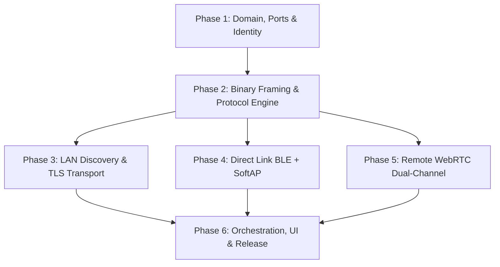

# DropFlow: Master Project Planning & Execution Roadmap

This document serves as the master index and sequential blueprint for building **DropFlow** from zero to a production-grade, cross-platform (Android, Linux, Windows) P2P file-sharing application.

---

## 🏗️ Architecture & Philosophy Summary

* **Hexagonal Architecture (Ports & Adapters):** Core domain logic is completely isolated from OS APIs, native drivers, and networking libraries.
* **3-Port Pipeline Decomposition:**
  1. `PeerDiscoveryPort`: Discovers and announces presence (mDNS, UDP multicast, BLE GATT, Remote PIN).
  2. `TransportPort` & `DropFlowTransport`: Establishes authenticated full-duplex byte/frame pipes (TLS 1.3 SecureSocket, RFC 8831 WebRTC DataChannels).
  3. `TransferProtocolEngine`: Network-agnostic transfer state machine (manifests, dynamic chunk hashing, sparse range set resumption, PartFileManager disk I/O, integrity checks).
* **Two-Tier Cryptographic Identity:** Long-lived Ed25519 identity key stored in hardware keystores signs ephemeral TLS/DTLS sessions for 100% MitM defense and fingerprint-based trusted device auto-accept.
* **Strict Mental Model Boundary:** 2 Tabs (`Nearby | Remote`). Nearby is local-only (never silently uses cellular/internet). Remote is deliberate (explicit 6-digit PIN / QR pairing).

---

## 📅 Sequential Phases Index

| Phase | Document | Core Deliverable | Key Tech & Deliverables |
| :---: | :--- | :--- | :--- |
| **01** | [`01_PHASE_1_HEXAGONAL_SCAFFOLDING_IDENTITY.md`](./01_PHASE_1_HEXAGONAL_SCAFFOLDING_IDENTITY.md) | Foundation & Identity | Flutter setup, domain entities, ports, Ed25519 `IdentityManager`, 2-tab UI shell |
| **02** | [`02_PHASE_2_FRAMING_DYNAMIC_CHUNKING_PROTOCOL_ENGINE.md`](./02_PHASE_2_FRAMING_DYNAMIC_CHUNKING_PROTOCOL_ENGINE.md) | Core Transfer Engine | 5-byte binary frame codec, dynamic chunk sizer, multi-part manifests, sparse range sets, `PartFileManager`, in-memory test harness |
| **03** | [`03_PHASE_3_LAN_DRIVER_AND_DISCOVERY.md`](./03_PHASE_3_LAN_DRIVER_AND_DISCOVERY.md) | Same-LAN Driver | RFC 6762 mDNS + UDP multicast beacon, TLS 1.3 `SecureSocket` client/server with identity cert validation |
| **04** | [`04_PHASE_4_DIRECT_LINK_BLE_SOFTAP.md`](./04_PHASE_4_DIRECT_LINK_BLE_SOFTAP.md) | Router-Free Direct Driver | `DirectLinkAdapter` capability probing, Android LocalOnlyHotspot, Linux NetworkManager AP, Windows Hotspot, BLE signaling |
| **05** | [`05_PHASE_5_REMOTE_WEBRTC_DUAL_CHANNEL.md`](./05_PHASE_5_REMOTE_WEBRTC_DUAL_CHANNEL.md) | Remote Internet WebRTC | WebSocket PIN signaling, RFC 8831 Dual DataChannels (`control` + `data`), backpressure loop, SAS emoji verification |
| **06** | [`06_PHASE_6_ORCHESTRATION_UI_POLISH_TESTING.md`](./06_PHASE_6_ORCHESTRATION_UI_POLISH_TESTING.md) | UI, Orchestration & Release | `TransferOrchestrator`, radar animations, docked mini-player, transfer sheets, settings, end-to-end integration tests, CI packaging |

---

## 🔁 Dependency Graph Between Phases

---

## ✅ Definition of Done (DoD) per Phase

Each phase must satisfy:
1. **Clean Code:** 0 analysis warnings (`flutter analyze`).
2. **Unit Tests:** $\ge 90\%$ test coverage on pure domain logic, codecs, range arithmetic, and crypto.
3. **No Mock Leaks:** Pure domain and protocol classes have zero dependencies on Flutter UI (`dart:ui`) or concrete OS platform channels.
4. **Documentation:** Synchronized with actual code signatures and models.

